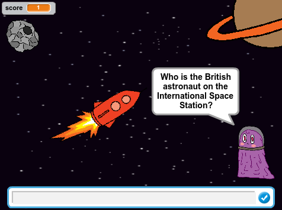

## Introduction

On 15 December 2015, British astronaut Tim Peake set off on the Principia mission to the International Space Station which is in orbit around Earth. Tim set up Astro Pi computers running children's code on the Space Station. This project was created for Tim's mission. Tim returned safely to Earth on 18 June 2016. 

You are going to create your own space quiz using interesting space facts.

  <iframe allowtransparency="true" width="485" height="402" src="https://scratch.mit.edu/projects/embed/88401398/?autostart=false" frameborder="0"></iframe>
  

__Hint:__ If you don't know the answers then read the Introduction to this project!

### Additional information for club leaders

If you need to print this project, please use the [Printer friendly version](https://projects.raspberrypi.org/en/projects/space-quiz/print).

--- collapse ---
---
title: Club leader notes
---

## Introduction:
In this project, children will learn how to make decisions based on user input. They will also learn how to move towards another sprite and detect a collision. 

## Space Mission
This project has been created to celebrate Tim Peake's Principia mission to the International Space Station where he will be deploying Astro Pi computers running code written by children. 

You can find out more at the <a href="http://principia.org.uk" target="_blank">principia.org.uk</a> website which is a useful resource for children to use when researching their own space quiz questions for this project. 

## Resources
For this project, Scratch 2 should be used. Scratch 2 can either be used online at [jumpto.cc/scratch-on](http://jumpto.cc/scratch-on) or can be downloaded from [jumpto.cc/scratch-off](http://jumpto.cc/scratch-off) and used offline.

The 'Project Materials' link for this project contains the following resources:

##### Club leader Resources

You can find a completed version of this project <a href="http://scratch.mit.edu/projects/88401398/#editor">online</a>, or it can be downloaded by clicking the 'Project Materials' link for this project, which contains:

+ SpaceQuiz.sb2

##### Project Resources

For this project, club members can make use of a Scratch project containing the required resources. This project is available at [jumpto.cc/space-quiz-resources](http://jumpto.cc/space-quiz-resources), or it can be downloaded by clicking the 'Project Materials' link for this project, which contains:

+ SpaceQuizResources.sb2

Make sure that each child has access to a copy of these resources.

## Learning Objectives
+ User Input;
+ Conditions (= operator);
+ Selection (if / else).

This project covers elements from the following strands of the [Raspberry Pi Digital Making Curriculum](http://rpf.io/curriculum):

+ [Combine programming constructs to solve a problem.](https://www.raspberrypi.org/curriculum/programming/builder)

## Challenges
+ "Add two more questions" - Using provided questions and answers;
+ "Meteoroid" - Add a meteoroid that moves towards a Spaceship when an incorrect answer is given;
+ "More questions" - Research and add more space quiz questions;

--- /collapse ---

--- collapse ---
---
title: Project materials
---
## Project resources
* [Online Scratch 2 project containing all project resources](http://jumpto.cc/space-quiz-resources)
* [Downloadable Scratch 2 project containing all project resources](resources/SpaceQuizResources.sb2)

## Club leader resources
* [Online completed Scratch 2 project](http://scratch.mit.edu/projects/88401398/#editor)
* [Downloadable completed Scratch 2 project](resources/SpaceQuiz.sb2)

--- /collapse ---
