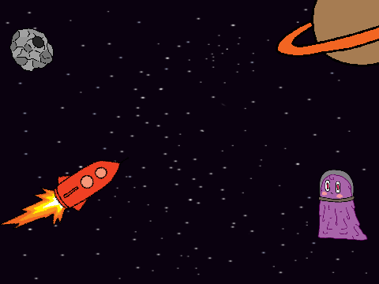
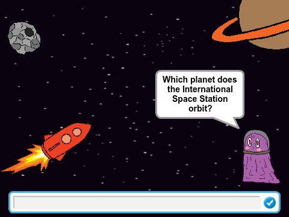

## Add a Quiz Question

Let's create your first space quiz question. 


+ Open the 'Space Quiz' Scratch project. Your club leader will give you a copy of this project, or you can open it online at <a href="http://jumpto.cc/space-quiz-resources" target="_blank">jumpto.cc/space-quiz-resources</a>.

	Your project should look like this:

	

+ Click on your 'Alien' sprite, and add the following code to ask the first question:

	```blocks
		when gf clicked
		ask [Which planet does the International Space Station orbit?] and wait
	```

+ Now you need to check the answer. An `if/else`{:class="blockcontrol"} block allows you to do something different depending on whether the question is answered correctly or not. 

	Add the following code after the `ask`{:class="blocksensing"} block:

	```blocks
		if <(answer) = [Earth]> then
		say [Yes!] for (2) secs
		else
		say [Sorry, that's not right.] for (2) secs
	```

+ Click the green flag to test your quiz question. Make sure you try the correct answer and an incorrect one. 

	


