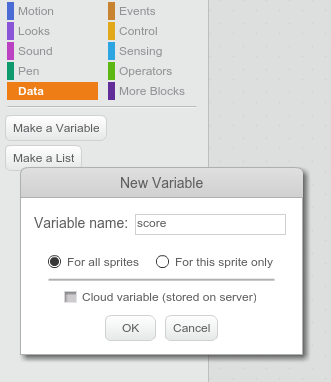
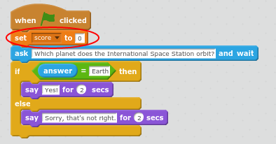
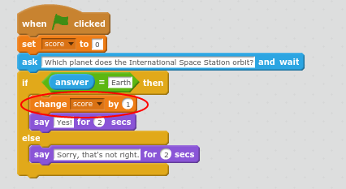
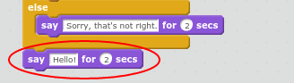
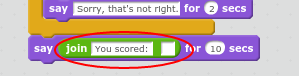
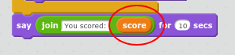
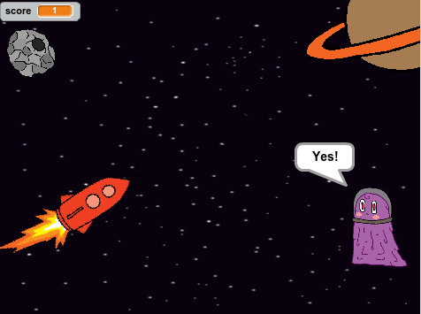

## Add a Score

Let's add a score that goes up by one point when you get a question correct. 

+ A variable is a place to store data. Let's create a variable to store the score. 

	Click `Data`{:class="blockdata"} and then click 'Make a Variable'. Call this variable `score`{:class="blockdata"}.

	

	The score variable will be displayed on the stage. 

+ You will need to set the score to zero at the beginning of the quiz. 

	Add a `set`{:class="blockdata"} block to your Alien's code:

	

+ When a question is answered correctly you need to increase the score. 

	Add a `change`{:class="blockdata"} block to your quiz question:

	

+ And let's have the Alien say the score at the end. 

	Add a `say` {:class="blocklooks"} block at the end of the Alien's code:

	

	You want the Alien to say "You scored: " followed by the score. To do this, firstly add a `join`{:class="blockoperators"} block into your Alien's `say`{:class="blocklooks"} block and type "You scored: " (without the quotes, but with a space at the end.) in the first box of the `join`{:class="blockoperators"} block:

	

	Now drag the `score`{:class="blockdata"} variable from `Data`{:class="blockdata"} into the second box of the `join`{:class="blockoperators"} block. 

	

+ Now click the green flag and test your code. Make sure that the score goes up when you get the question correct and stays the same when you get it incorrect. 

	

