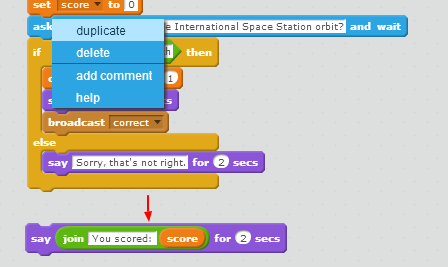

--- challenge ---
## Challenge: Add two more questions
Can you add these two questions to your quiz:

**Question:** Which British astronaut joined the International Space Station in 2015? **Answer:** Tim Peake   
**Question:** Which computer ran children's code on the International Space Station? **Answer:** Astro Pi   

To save yourself some work you can duplicate the quiz question code you already have by right-clicking on the first block that you want to copy and selecting 'duplicate':

You don't want to duplicate the `say`{:class="blocklooks"} block that shows the score so just drag that away before you duplicate and add it back in at the end after all of your questions.

You'll need to change the __question__ and the __answer__ in the duplicated code for each new question. 

--- /challenge ---