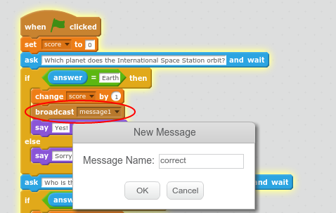
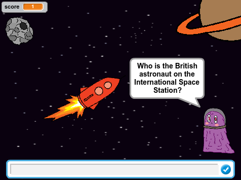
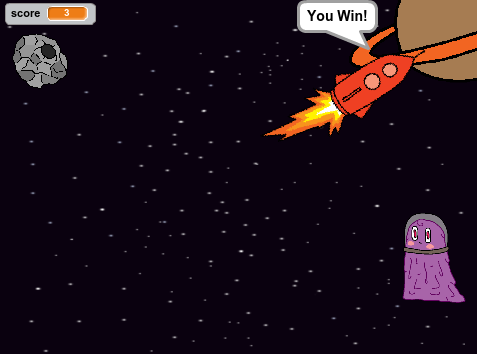

## Making the Spaceship Move

Next you're going to make the spaceship move towards the planet and play a sound every time you get a question correct. 


+ In Scratch you can broadcast a message to let other sprites know that something has happened. Let's broadcast a message when you answer a quiz question correctly. 

	Drag a `broadcast`{:class="blockevents"} block after the `change`{:class="blockdata"} block where you increase the score in the first quiz question. Click on the down arrow and choose 'new message' and call the new message 'correct':

	

+ Also add the following code after the `change`{:class="blockdata"} block in your other quiz questions:

	```blocks
		broadcast [correct v]	
	```

+  Now you're going to work on the '__Spaceship__' instead of the Alien. Click on the '__Spaceship__' sprite and add the following code to get the Spaceship in the right place at the beginning of the quiz:

	```blocks
		when gf clicked
		go to x: [-160] y: [-55]
		point towards [Planet v]
	```

+ Add the following code to the '__Spaceship__' to play a sound and make it move towards the planet when a question is answered correctly:

	```blocks
		when I receive [correct v]
		play sound [spiral v]
		move [100] steps
	```

+ Test your project and make sure the Spaceship moves towards the planet and plays a sound when you get a question correct. 

	

+ If you answer enough questions to reach the Planet then you've won the game. Scratch has a `touching`{:class="blocksensing"} block for detecting collisions. 

	Add the following code to the end of the Spaceship's green flag script:

	```blocks
		forever
		if (touching [Planet v] ?)
		say [You win!] for (5) secs
		stop [all v]
	```

+ Test your project and answer all the questions correctly so that you reach the planet. 

	

