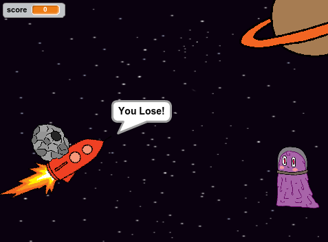

--- challenge ---
## Challenge: Meteoroid
Can you add code to the Meteoroid so that it moves towards the Spaceship everytime you get a question incorrect? If the Meteorite touches the Spaceship then tell the player they have lost. 

You'll need to make sure the Meteoroid points towards the Spaceship before it moves because the Spaceship will also be moving. 

--- /challenge ---